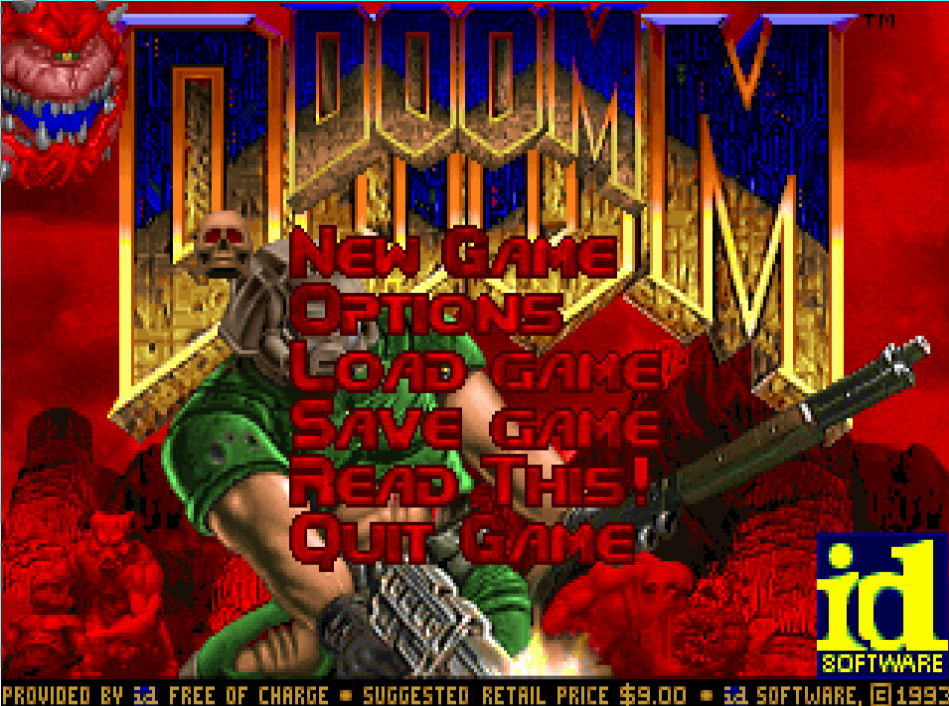
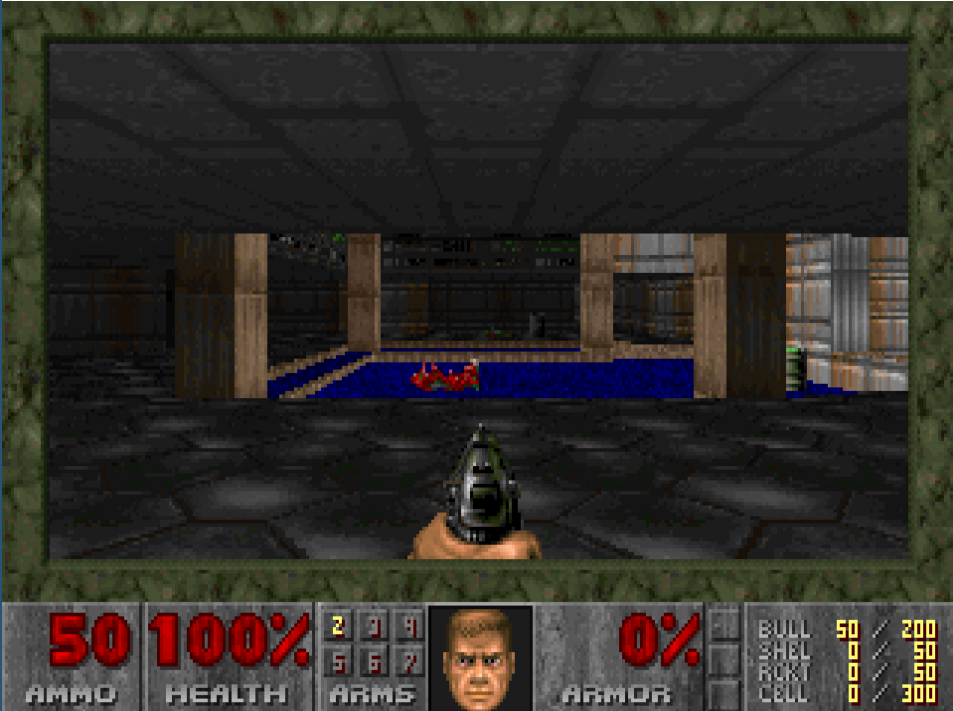
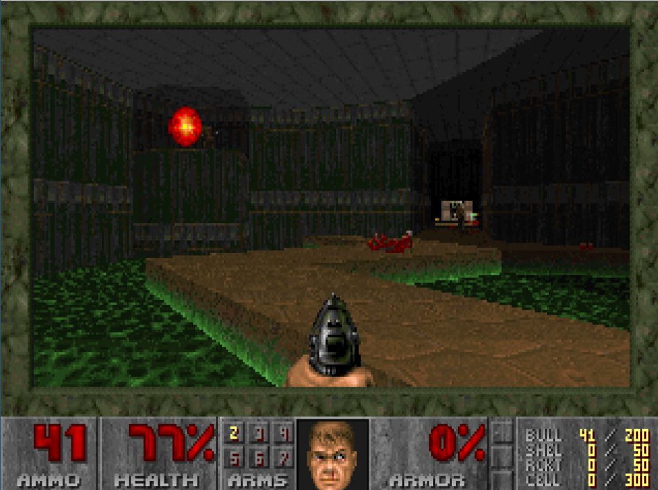
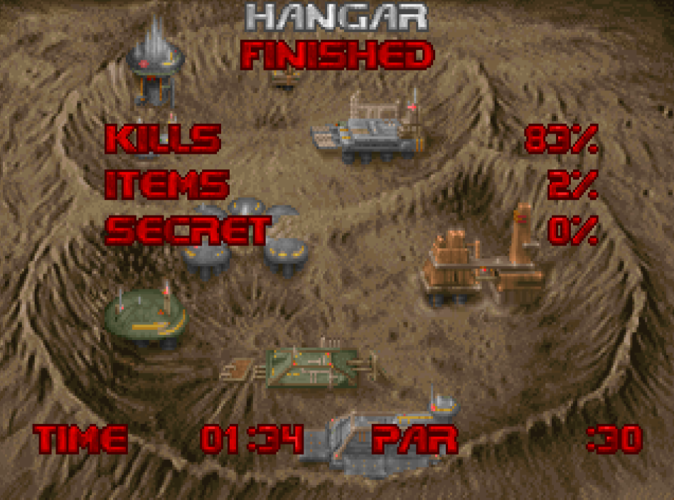

# Brie Doom
DOOM source port in Eiffel with SDL2

Brie is pronounced */briː/* like Brie cheese :cheese:

Brie Doom's website is located at https://briedoom.imustafin.tatar

Based on the original source port release https://github.com/id-Software/DOOM
with autio/video output inspired by https://github.com/chocolate-doom/chocolate-doom.

Big thanks to https://github.com/makava/sdldoom-1.10-mod for a version
which compiles on modern systems.

## Screenshots
This project is now in active development and everything changes frequently.
Anyways, here are some pictures:

## Requirements
* My wrap_sdl fork https://github.com/imustafin/wrap_sdl

## Troubleshooting

### No music
Depending on the configured music device, Brie Doom might use MIDI output 
for music. In this case, check the correspondent SDL Mixer env vars like:
* `SDL_SOUNDFONTS` for setting the path to the soundfont.
Fluid R3 General MIDI Soundfont is known to work.
Set it like `SDL_SOUNDFONTS=/usr/share/soundfonts/FluidR3_GM.sf2`.
